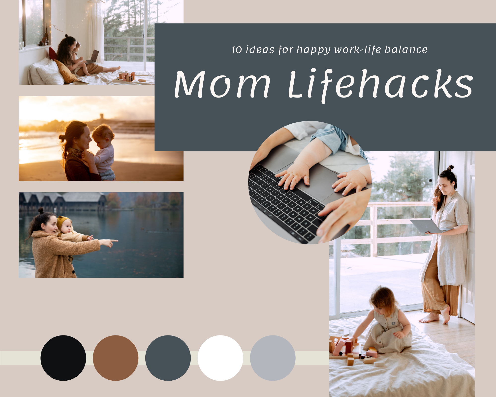
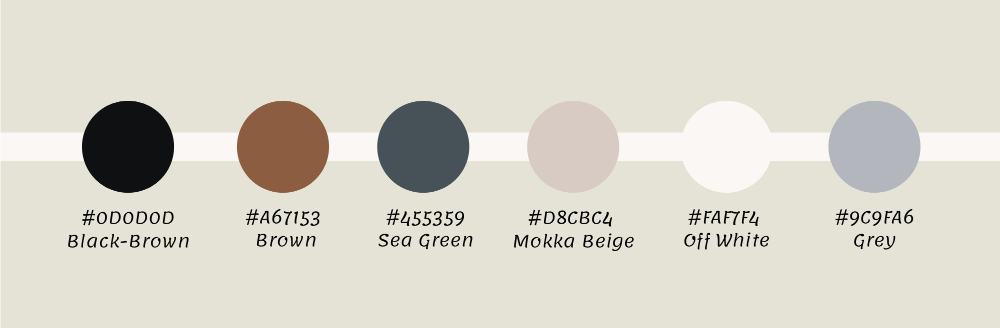

# Mom Lifehacks

## 10  ideas for happy work-life balance

Build a Lifehacks website

External user’s goal:

The site’s users are interested in solving everyday problems in an intuitive and engaging way

Site owner's goal:

The goal of the site is to be the primary source of solutions to genuinely useful life hacks

Potential features to include:

Lifehack categories and supporting information
Supporting text/images/video demonstrating the life hack

### Mood Board:

### Wireframes:

### Colors:

### GitHub page:

The current live version of the project is can be seen here:
https://annagabain.github.io/Mom-Lifehacks

### Project Steps:

- [x] read project requirments 

- [x] brainstorm about the idea

- [x] find content
  - [x] sources
  - [x] images
  
- [x] design wireframes
  - [x] choose basic colors

- [x] create a repository on GitHub
  - [x] setup
  - [x] basic structure
  - [x] initial commit
 
- [x] create the site skeleton
  - [x] basic layout
  - [ ] text content
  - [ ] images
  - [ ] css structure rules
 
- [x] design the mood board with colors and themes
  - [ ] apply the colors to the css
 
- [ ] test
  - [ ] check for errors
  - [ ] validate html
  - [ ] validate css
  - [ ] accessibility

- [ ] deploy
  - [x]  GitHub pages
  - [ ]  edit the Readme file
    - [ ] introduction
    - [ ] the title image (4 responsive formats)
    - [ ] describe the sections and attach images to each
    - [ ] testing and deployment details
    - [ ] credits to content and media 
  - [ ]  finishing touches

- [ ] go through the requirements checklist
- [ ] submit the project

### Sources & Credits:

How-to references: https://www.w3schools.com/

Lifehack icons: https://fontawesome.com/

#### Content:

https://www.themuse.com/advice/13-life-hacks-for-careerloving-moms-and-dads

https://www.withlovebecca.com/working-mom-hacks/

https://theeverymom.com/life-hacks-for-working-moms/

https://www.forbes.com/sites/financialfinesse/2017/12/03/lifehacks-that-make-being-a-working-mom-a-little-bit-easier/

#### Images:

https://www.pexels.com/@tatianasyrikova viewed on 15.05.2022

https://www.pexels.com/@karolina-grabowska/ viewed on 14.05.2022

#### Tools:

Mood board creation on  https://www.canva.com/ platform on 17.05.202

Color palette selection with https://color.adobe.com/create/color-wheel on 17.05.202
