# Mom Lifehacks

Mom Lifehacks is a website presenting 10 work-life balance ideas to working mothers. It aims to make their lives less stressfull and therefore happier. The lifehacks can be useful for home stay mothers, fathers and other child caretakers as well.

This is the first Portfolio Project in frames of Code Institute Full Stack Web Developer Course Assessment. It is for educational purposes and the main programming languages are HTML and CSS. Further tools and languages will be implemented for the consequent projects. 

Below you can see the image of the website on different devices, as well as further information about how it was developed, tested and deployed.

## View the Live Website :point_down:

## [Live View Here](https://annagabain.github.io/Mom-Lifehacks/index.html)

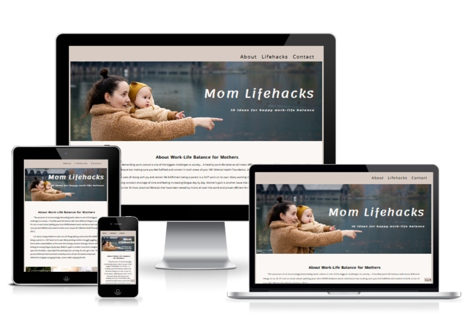

## Contents:

- [Features](#features)
  - [Navigation bar](#navigation)
  - [About (Work-Life)](#about-work-life)
  - [10 Lifehacks](#10-lifehacks)
  - [Contact](#contact)
  - [Footer](#footer)

- [Development Stages](#development-stages)
  - [Planning](#planning)
  - [Layout Creation](#layout-creation)

  - [User Experience and User Interface Design UX and UI](#User-Experience-and-User-Interface-Design-UX-and-UI)
    - [Design Scope](#design-scope)
    - [Mood Board](#mood-board)
    - [Wireframes](#wireframes)
    - [Colours](#colours)
  - [Accessibility and responsivity](#accessibility-and-responsivity)
    - [Accessibility](#accessibility)
    - [Responsivity](#responsivity)

  - [Testing](#testing)
    - [Validators](#validators)
    - [Implementation](#implementation)

  - [Deployment to GitHub](#deployment-to-github)
    - [GitHub Pages](#github-page)

- [Documentation](#documentation)
  - Code structure
  - Organization

- [Sources & Credits](#sources--credits)
  - [Content Ideas](#content-ideas)
  - [Images](#images)
  - [Tools](#tools)

## Features

### Navigation

Navigation bar on the top right of the website

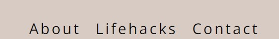

Navigation bar when hovering over with a mouse

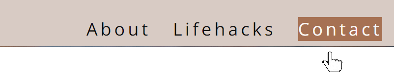

Navigation bar to the left of the screen for mobile devices and moving along with the navigation (fiexed positioning.)

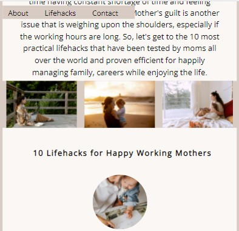

Jump to a Lifehack bar

Top button that is fixed to the bottom no matter where you scrolled

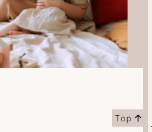

:arrow_up: [Back to Contents](#contents) 

### About Work-Life

An introduction for the content telling about importantce of work-life balance for mothers. This is the first out of three sections of the website.s

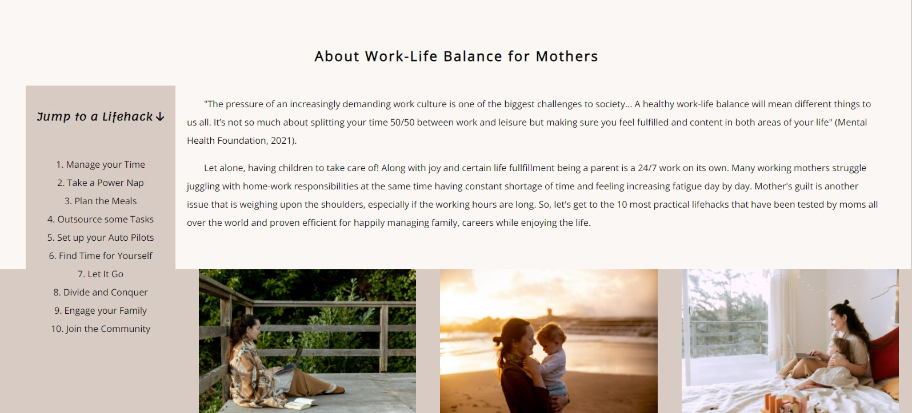

### 10 Lifehacks

medalion inspirational images
changing number of columns to be convenient to read on mobiles, tablets and desktops

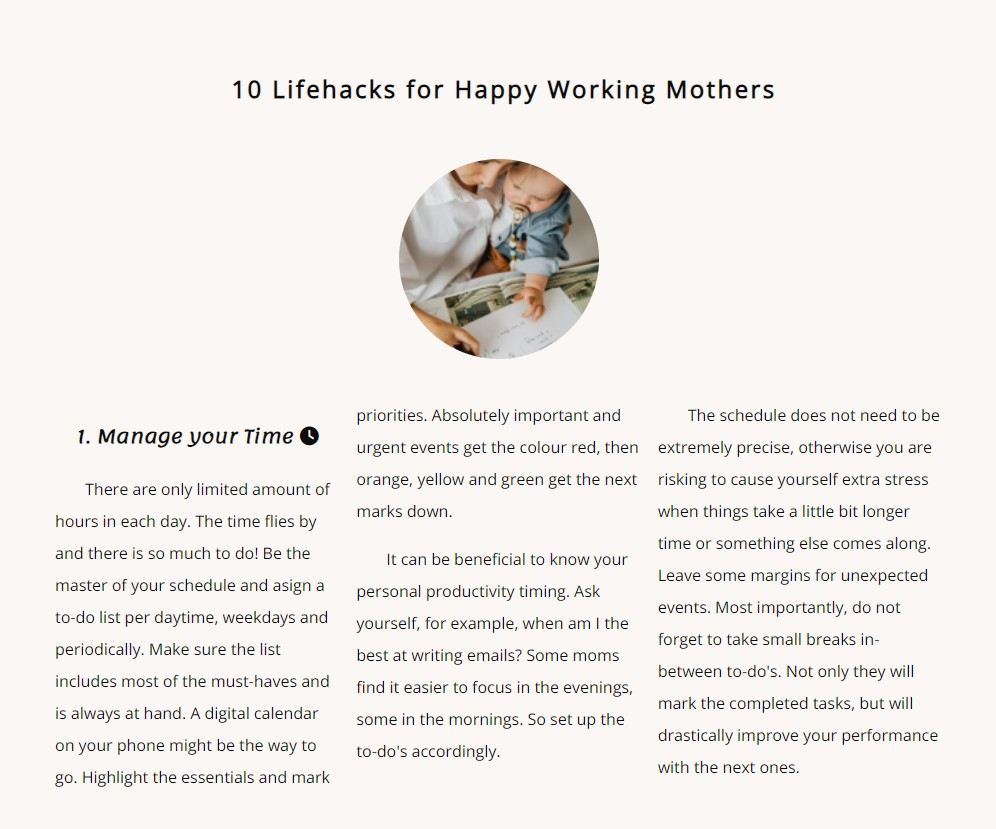

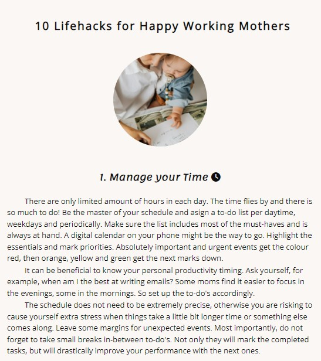

### Contact
contact form with a submit (dummy button)

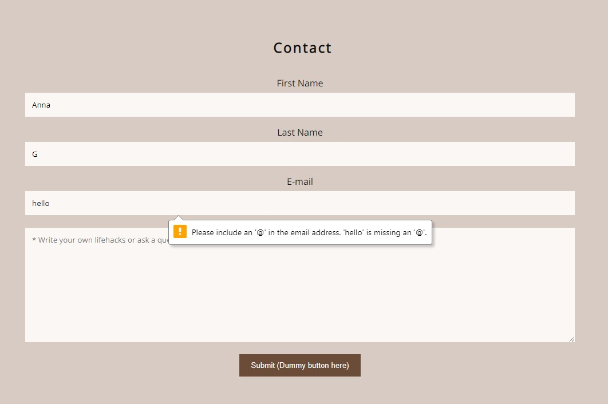

### Footer

Social media icons with links

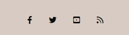

:arrow_up: [Back to Contents](#contents) 

## Development Stages:

### Planning

- [x] read project requirments 

- [x] brainstorm about the idea

- [x] find content
  - [x] sources
  - [x] images
  
### Layout Creation

- [x] create a repository on GitHub
  - [x] setup
  - [x] basic structure
  - [x] initial commit
 
- [x] create the site skeleton
  - [x] basic layout
  - [x] text content
  - [x] images
  - [x] css structure rules

:arrow_up: [Back to Contents](#contents) 

## User Experience and User Interface Design UX and UI

### Design Scope

- [x] design wireframes
  - [x] choose basic colors

- [x] design the mood board with colors and themes
  - [x] apply the colors to the css

### Mood Board:

### Wireframes:

### Colours:

:arrow_up: [Back to Contents](#contents) 

## Accessibility and Responsivity

### Accessibility

Semantic Html
Text Content
  headings, paragraphs, lists...
Page Layouts
 title, url, headings, text (keywords), link text, image alt, meta description, 
UI Controls
  buttons, links, forms, tab key?
Form Labels
  label, id, for, fieldset
ARIA attributes !!!

Aria
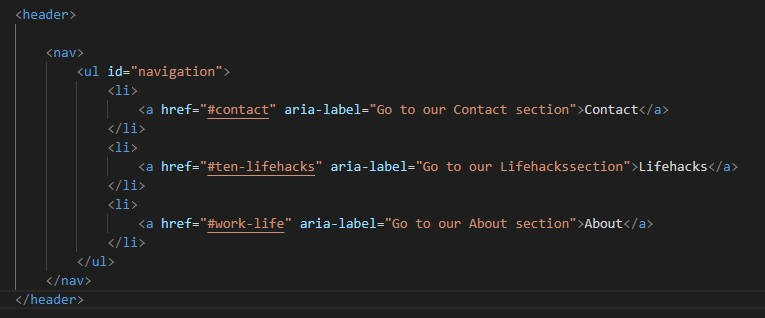
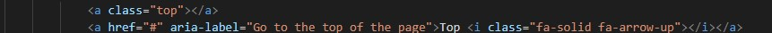
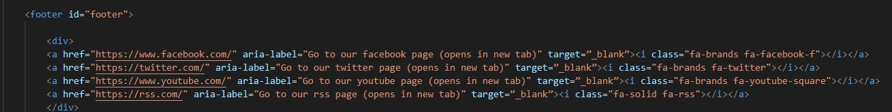

Alt

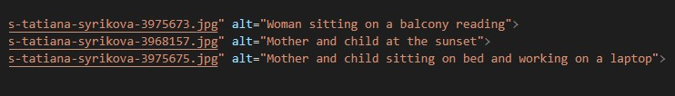

Contrast 

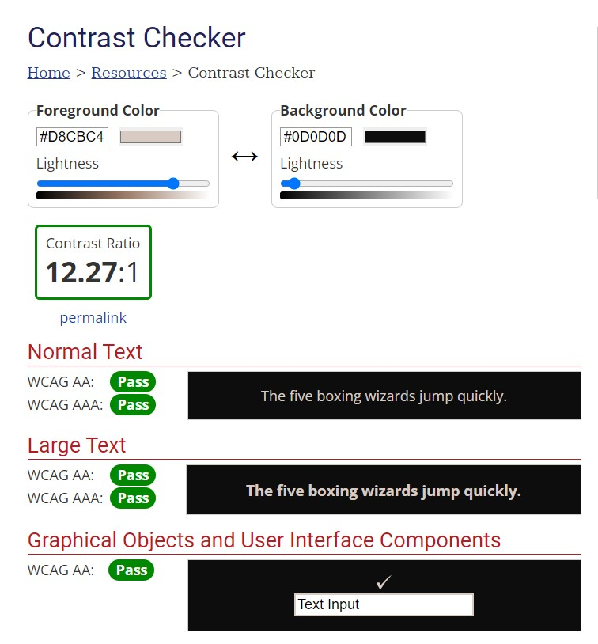 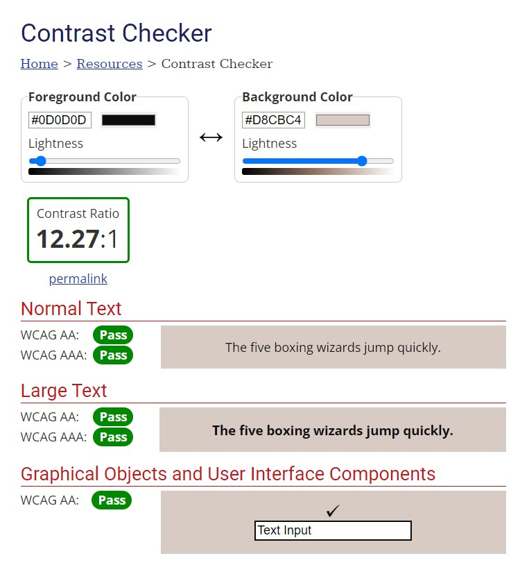

### Responsivity

Media queries

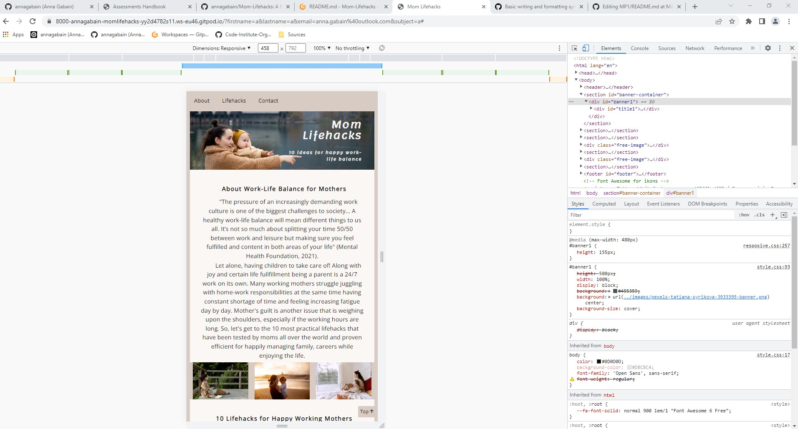

### Testing

#### Validators 
- [ ] test
  - [x] check for errors
  - [x] validate html
  - [x] validate css

 Chrome Developer Tools

 Media Queries

 Lighthouse

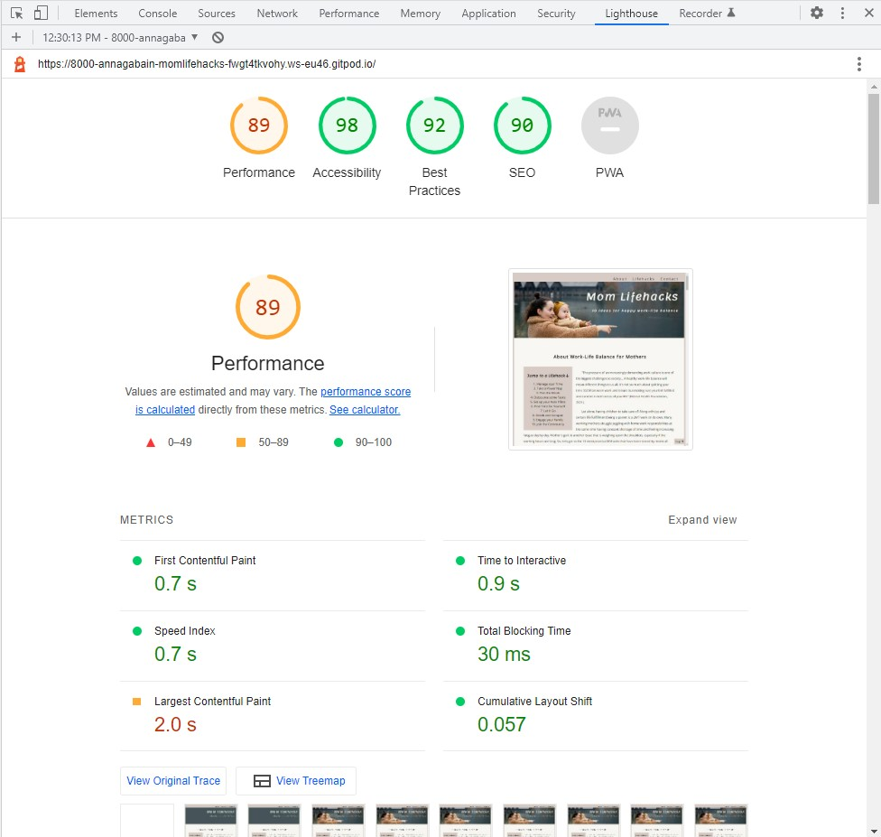

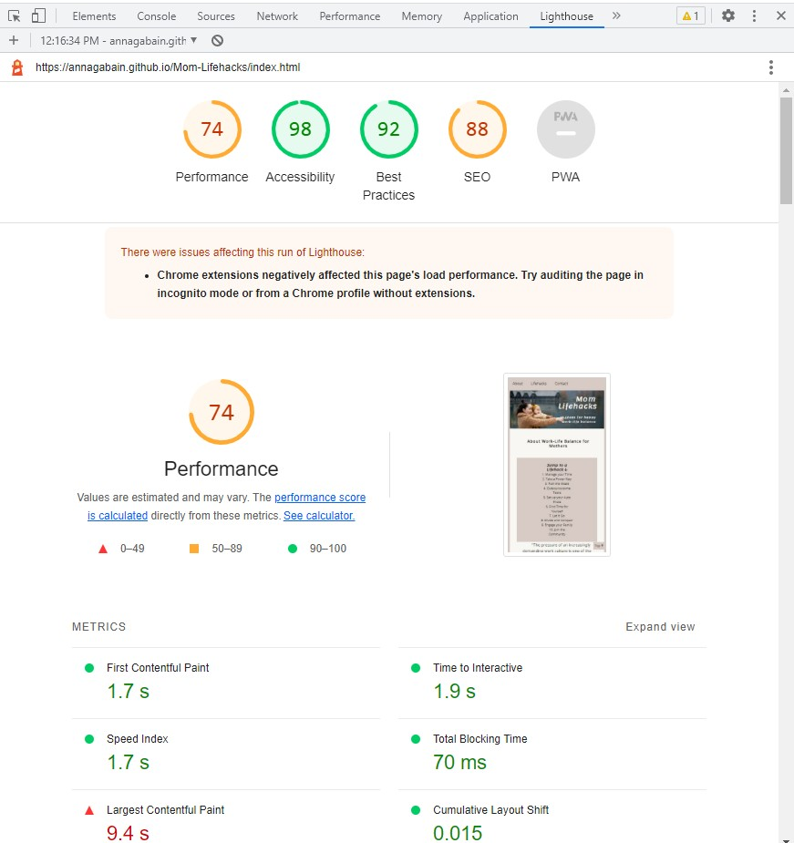

  - [ ] accessibility

  Validate HTML in https://validator.w3.org/

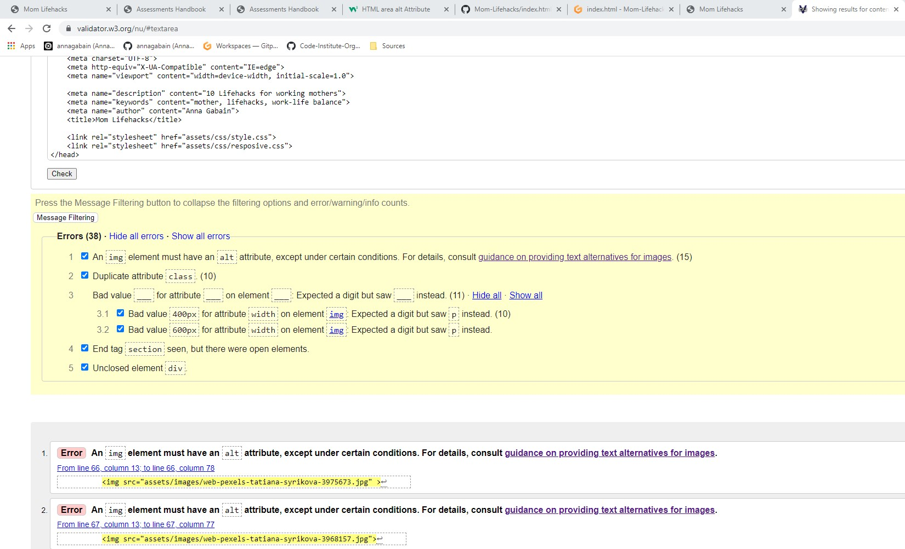

  Validate CSS in https://jigsaw.w3.org/css-validator/

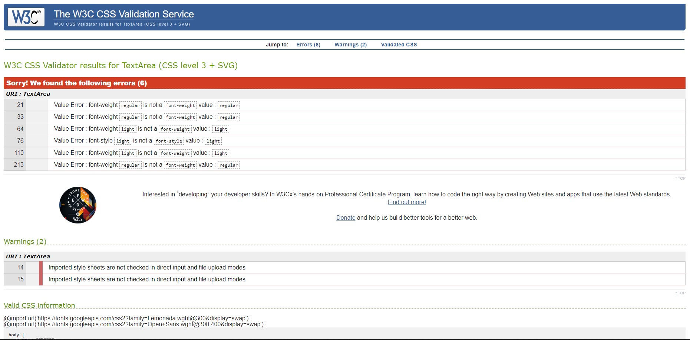

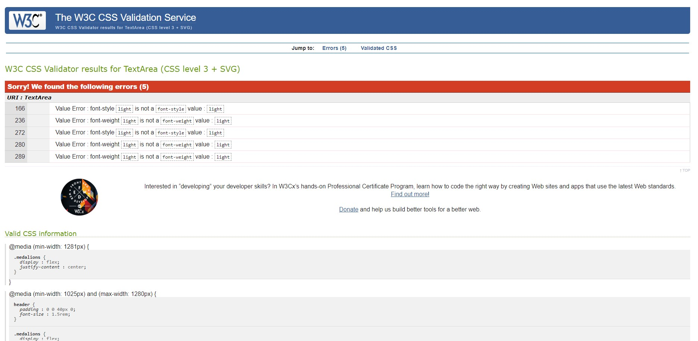

:arrow_up: [Back to Contents](#contents) 

## Implementation

- [x] deploy to GitHub pages
  - [ ]  edit the Readme file
    - [x] introduction
    - [x] the title image (4 responsive formats)
    - [ ] describe the sections and attach images to each
    - [x] testing and deployment details
    - [x] credits to content and media 
  - [ ]  finishing touches

- [x] go through the requirements checklist
- [ ] submit the project

### Deployment to GitHub

#### GitHub page:

The current live version of the project can be seen here:
https://annagabain.github.io/Mom-Lifehacks/index.html

# Documentation
## Code structure
## Organization

:arrow_up: [Back to Contents](#contents) 

## Sources & Credits:

How-to references: https://www.w3schools.com/

Lifehack icons: https://fontawesome.com/

### Content ideas:

https://www.themuse.com/advice/13-life-hacks-for-careerloving-moms-and-dads

https://www.withlovebecca.com/working-mom-hacks/

https://theeverymom.com/life-hacks-for-working-moms/

https://www.forbes.com/sites/financialfinesse/2017/12/03/lifehacks-that-make-being-a-working-mom-a-little-bit-easier/

https://www.sleepcycle.com/how-to-fall-asleep/how-to-power-nap-like-a-pro/

https://www.theodysseyonline.com/4-reasons-your-family-best-support-system

https://www.lifehack.org/734000/ways-working-moms-balance-work-and-family

https://www.mentalhealth.org.uk/a-to-z/w/work-life-balance

https://defeatingbusy.com/10-tasks-moms-consider-hiring-out/

https://player.fm/series/brainy-moms/busy-mom-how-to-run-your-home-on-autopilot-with-guest-carrie-olsen-lcsw

https://en.wikipedia.org/wiki/Divide-and-conquer_algorithm

https://workingmomkind.com/

https://callemmy.com/morning-routine-for-working-moms/

### Images:

https://www.pexels.com/@tatianasyrikova viewed on 15.05.2022

https://www.pexels.com/@karolina-grabowska/ viewed on 14.05.2022

### Tools:

Mood board creation on  https://www.canva.com/ platform on 17.05.202

Color palette selection with https://color.adobe.com/create/color-wheel on 17.05.2022
