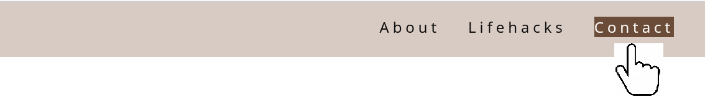
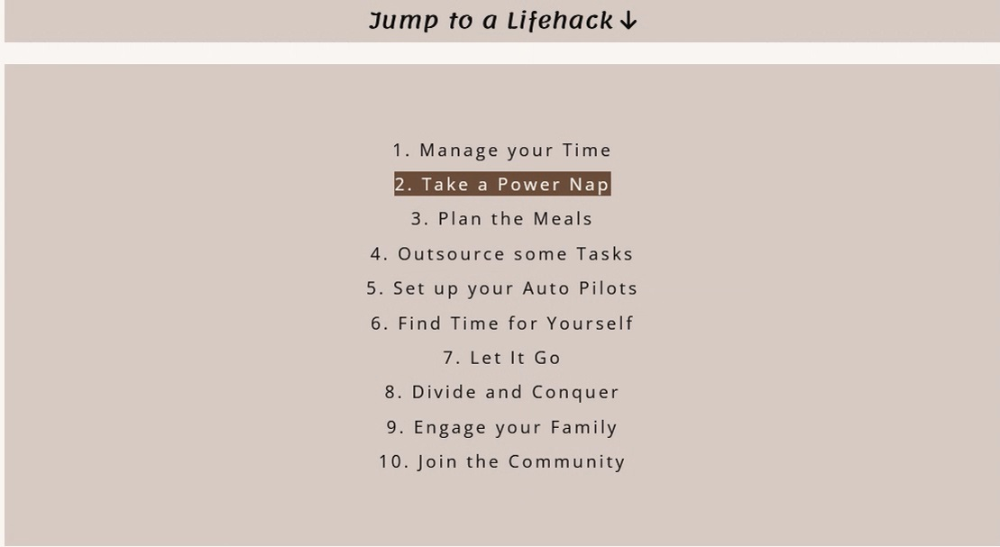
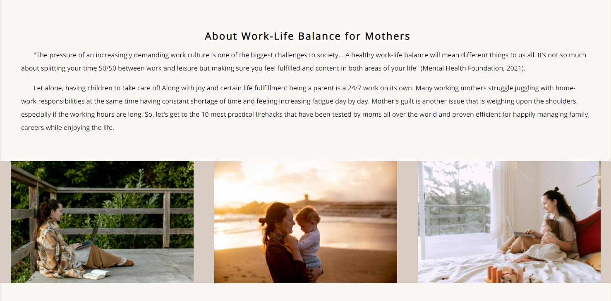
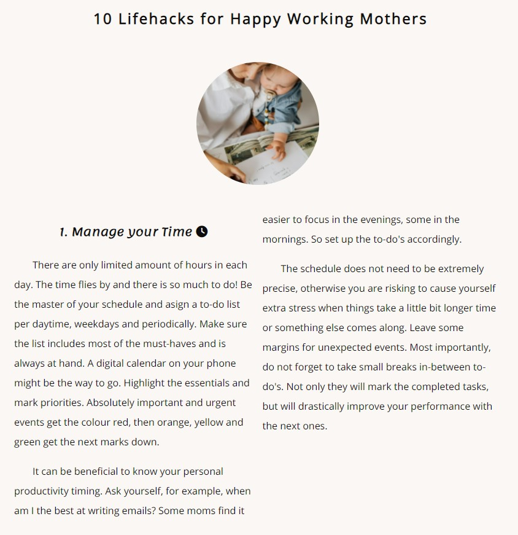
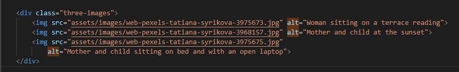

# Mom Lifehacks

Mom Lifehacks is a website presenting 10 work-life balance ideas to working mothers. It aims to make their lives less stressfull and therefore happier. The lifehacks can be useful for home stay mothers, fathers and other child caretakers as well.

This is the first Portfolio Project in frames of Code Institute Full Stack Web Developer Course Assessment. It is for educational purposes and the main programming languages are HTML and CSS. Further tools and languages will be implemented for the consequent projects. 

Below you can see the image of the website on different devices, as well as further information about how it was developed, tested and deployed.

## [View the Live Website](https://annagabain.github.io/Mom-Lifehacks/index.html)

## Contents:

- [Features](#features)
  - [Navigation](#navigation)
  - [About (Work-Life)](#about-work-life)
  - [10 Lifehacks](#10-lifehacks)
  - [Contact](#contact)
    - [Thank you for Contacting Page](#thank-you-for-contacting-page)
  - [Footer](#footer)
  - [404 Error Page](#404-error-page)
  - [Potential Features left to Implement](#potential-features-left-to-implement)

- [Development Stages](#development-stages)
  - [Planning](#planning)
  - [Layout Creation](#layout-creation)

  - [User Experience and User Interface Design UX and UI](#User-Experience-and-User-Interface-Design-UX-and-UI)
    - [User Analysis With 'Persona' Method](#user-analysis-with-persona-method)
    - [Design Scope](#design-scope)
    - [Mood Board](#mood-board)
    - [Wireframes](#wireframes)
    - [Colours](#colours)
  - [Accessibility and responsivity](#accessibility-and-responsivity)
    - [Accessibility](#accessibility)
    - [Responsivity](#responsivity)

  - [Testing](#testing)
    - [Validators](#validators)
    - [Remaining Bugs](#remaining-bugs)

  - [Deployment to GitHub](#deployment-to-github)
    - [GitHub Pages](#github-page)

- [Sources & Credits](#sources--credits)
  - [Content Ideas](#content-ideas)
  - [Images](#images)
  - [Tools](#tools)

## Features

### Navigation

Navigation bar on the top right of the website allows the user to find all the main sections of the website. Hovering over the navigation items highlights it to white text on brown background indicating to the user that the link is ready to be clicked on.

Navigation bar has fixed positioning for mobile devices and staying on top of the page along with scrolling.

Jump to a Lifehack section helps the user to quickly jump into reading the lifehack they are mostly interested in without scrolling through all of them. A valuable feautre for working parents, who have limited time to read this webpage. 
Jump to a Lifehack section adapts the number of colums to adjust to the device it is being viewed on.

Top button that is fixed to the bottom no matter where you scrolled

:arrow_up: [Back to Contents](#contents) 

### About Work-Life

An introduction for the content telling about importantce of work-life balance for mothers. This is the first out of three sections of the website.s

### 10 Lifehacks

Medalion inspirational images are placed above every lifehack.
The content changes the number of columns to adapt bing convenient to read on mobiles, tablets and desktops.

### Contact
Contact form with a submit button. This form is providing the user a possibility to contact with the website author by giving a feedback about the lifehacks. All the fields are mandatory to be able to fully submit the form.

#### Thank you for Contacting Page

After successfully submitting the feedback, a new 'thank you' page opens to reassure the user that the message has been recieved and will be responded to soon. The user has a possibility to continue surfing the website using the navigation menu buttons that lead back to the main page sections.

### Footer

Social media icons with links to correspoding social media sites. As this project is currently for the educational purposes and there are not 'Mom Lifehacks' community pages, the buttons simply lead to the social media homepages instead.

### 404 Error Page

This page opens in case there are broken links and the user requeted a page that does not exist. As with the 'thank you' page, the user has a possibility to further navigate to the main website.

### Potential Features left to Implement

Some videos demonstrating several lifehacks can be potentially valuable added feature.

:arrow_up: [Back to Contents](#contents) 

## Development Stages:

### Planning

The following to-do list made it possible to consequently plan the project and execute it.

- [x] read project requirments 

- [x] brainstorm about the idea

- [x] find content
  - [x] sources
  - [x] images

- [x] create the site skeleton
  - [x] basic layout
  - [x] write text content
  - [x] add images
  - [x] create css structure rules

- [x] design
  - [x] design wireframes
  - [x] choose basic colors
  - [x] design the mood board with colors and themes
  - [x] apply the colors to the css

- [x] create a repository on GitHub
  - [x] setup
  - [x] basic structure
  - [x] initial commit
 
- [x] deploy to GitHub pages
  - [x]  edit the Readme file
    - [x] introduction
    - [x] the title image (4 responsive formats)
    - [ ] describe the sections and attach images to each
    - [x] testing and deployment details
    - [x] credits to content and media 
  - [x]  finishing touches

  - [x] test
    - [x] check for errors
    - [x] validate html
    - [x] validate css

- [x] go through the requirements checklist
- [x] submit the project
  
### Layout Creation

The so-called site skeleton was created by adding basic html and css, as well as assets folders to the repository. A basic layout of the head-body-footer and a connected file with css structure rules started off the project. 

:arrow_up: [Back to Contents](#contents) 

### User Experience and User Interface Design UX and UI

#### User Analysis With 'Persona' Method

In order to identify and get to know the website user, Persona method was chosen. 
This method helps 'bringing to life' a real individual with personality traits, favourite choices and preferences. Jane Smith is a working mother that loves biological products and natural tones. She will enjoy the website design and hopefully find the ideas on the website useful to impelment in life.
The persona summary is created with a tool called Xtensio that helps to conduct vidual UX analysis.

### Design Scope

Wireframes were created to have a rough scetch what the future website structure would look like. Basic colors choice was conducted by extracting colors from the images and making sure they complement each other, as well as provide necessary contrast for the content readability.

Mood board with colors and themes gave a general idea what the website would look like in terms of the font choice and overall visual impression. The these colours were applied to the style.css and responsive.css stylesheets to unify the project.

### Mood Board:

### Wireframes:

### Colours:

:arrow_up: [Back to Contents](#contents) 

## Accessibility and Responsivity

### Accessibility

There is no limit to applied accessibility, however the following aspects were paid attention to:
 - Semantic Html - The tags of the html document were named semantically to make sense. Header, Navigation, Section, Paragraph, Footer.
 - Text Content - headings, paragraphs, lists in hierarchic order to be analysed by screen readers.
 - Page Layouts - title, url, headings, using site keywords, such as Lifehack, Mom in the paragraph texts, image alt attributes for visually impaired, site meta description in the head section.
 - Form Labels - label, id, for.
 - ARIA attributes- aria-labels to anchor tags for navigation.

 

Aria

Alt

Contrast 

### Responsivity

Website responsivity to different device sizes is achieved with CSS Media queries. The following breaking points were taken: 

  - Large screens and high resolution desktops (min-width: 1281px)

  - Laptops and Desktops (min-width: 1025px) and (max-width: 1280px)

  - Tablets and Ipads in portrait orientation (min-width: 768px) and (max-width: 1024px) 

  - Tablets and Ipads in landscape orientation (min-width: 768px) and (max-width: 1024px) 

  - Low Resolution Tablets and Mobiles in landscape orientation (min-width: 481px) and (max-width: 767px)

  - Most of the Smartphones Mobiles (min-width: 320px) and (max-width: 480px)

### Testing

A series of testing actions have been performed during and after coding. 
Main methods: 
- manual testing on different devices (Large monitor, Laptop, iPad, iPhone) 
- testing through VS code live view in Chrome Developer Tools, in particular through Media Queries and Lighthouse tools.
- contrast check with https://webaim.org/resources/contrastchecker/
- accessibility check with WAVE Chrome extension

#### Chrome Developer Tools

 Chrome Developer Tools and Media Queries

 Lighthouse

WAVE extension in Chrome browser

#### Validators 

  Validate HTML in https://validator.w3.org/

  The files index.html, form-response.html and 404.html were tested through the validator.

The files style.css and responsive.css were tested through the validator:  https://jigsaw.w3.org/css-validator/

All the errors have been addressed and fixed. After fixing the errors, a validator badge was awarded.

        

    

#### Remaining Bugs

Most of the errors and bugs have been adressed and fixed. However, depending on the time of the day, Google Developer Tool Lighthouse perfromance showed different results varying from 73% to 90%. 
The lowest result of about 73% indicated slow performance. especially for mobile devices. This bug mostly occurs due to the images being larger than recommended for a quick web performance. This bug is treated as an 'oportunity' for future image resizing and better optimisation.

:arrow_up: [Back to Contents](#contents) 

### Deployment to GitHub

Deployment to GitHub was done at the very beginning of the project for convenience of the current version control. After creating a new repository based on Code Institute's project template, in settings, the 'pages' option was chosen. After choosing the branch and confirming, the page was published on GitHUb server available for live public view. Potential placement on an own server is possible in the future.

#### GitHub page:

The current live version of the project can be seen here:
https://annagabain.github.io/Mom-Lifehacks/index.html

:arrow_up: [Back to Contents](#contents) 

## Sources & Credits:

How-to references: https://www.w3schools.com/

Lifehack icons: https://fontawesome.com/

Practical advice about UX: Book - Praxisbuch Usability und UX
Was alle wissen sollten, die Websites und Apps entwickeln (in German)
by Jens Jacobsen, Lorena Meyer, Rheinwerk Computing, edition 2017
https://www.rheinwerk-verlag.de/praxisbuch-usability-und-ux/

### Content ideas:

https://www.themuse.com/advice/13-life-hacks-for-careerloving-moms-and-dads

https://www.withlovebecca.com/working-mom-hacks/

https://theeverymom.com/life-hacks-for-working-moms/

https://www.forbes.com/sites/financialfinesse/2017/12/03/lifehacks-that-make-being-a-working-mom-a-little-bit-easier/

https://www.sleepcycle.com/how-to-fall-asleep/how-to-power-nap-like-a-pro/

https://www.theodysseyonline.com/4-reasons-your-family-best-support-system

https://www.lifehack.org/734000/ways-working-moms-balance-work-and-family

https://www.mentalhealth.org.uk/a-to-z/w/work-life-balance

https://defeatingbusy.com/10-tasks-moms-consider-hiring-out/

https://player.fm/series/brainy-moms/busy-mom-how-to-run-your-home-on-autopilot-with-guest-carrie-olsen-lcsw

https://en.wikipedia.org/wiki/Divide-and-conquer_algorithm

https://workingmomkind.com/

https://callemmy.com/morning-routine-for-working-moms/

### Images:

https://www.pexels.com/@tatianasyrikova viewed on 15.05.2022

https://www.pexels.com/@karolina-grabowska/ viewed on 14.05.2022

### Tools:

Mood board creation on  https://www.canva.com/ platform on 17.05.2022

Color palette selection with https://color.adobe.com/create/color-wheel on 17.05.2022

'Persona'bord creation with https://xtensio.com last edit on 02.06.2022

Contrast check with https://webaim.org/resources/contrastchecker/

Chrome Developer Tools

### Acknoledgements:

Adegbenga Adeye - Code Institute mentor, that helped with conceptual directing, sources and how-to-s.

Jakob Lövhall - author's partner providing babysitting support during longer working hours, as well as giving constructive feedback about the project.